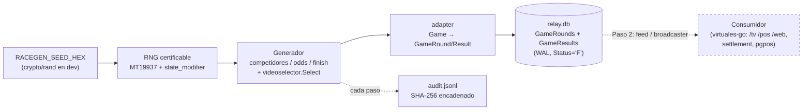
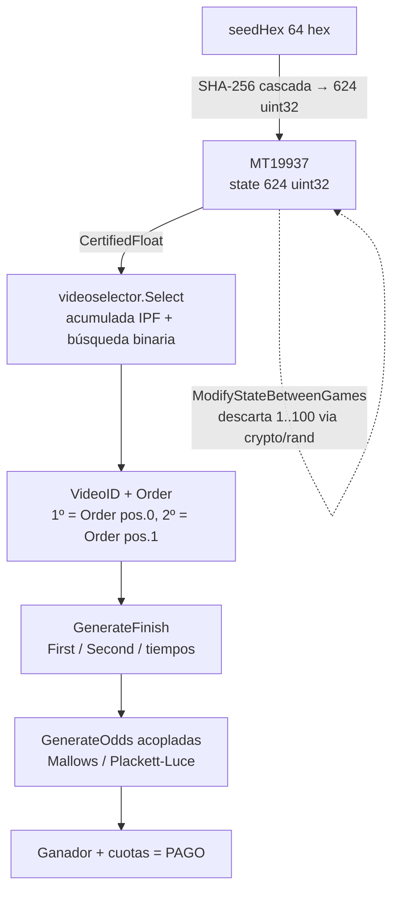
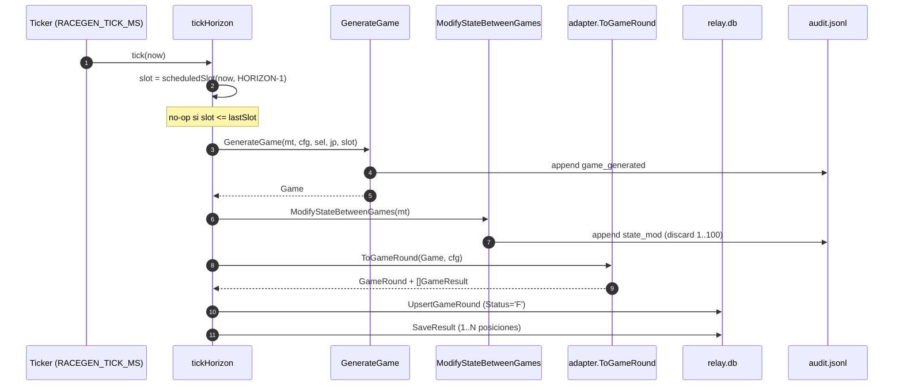
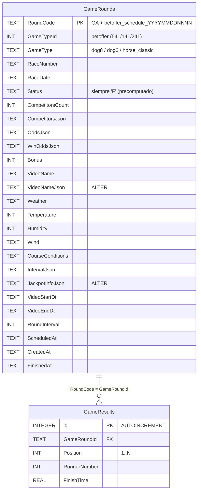
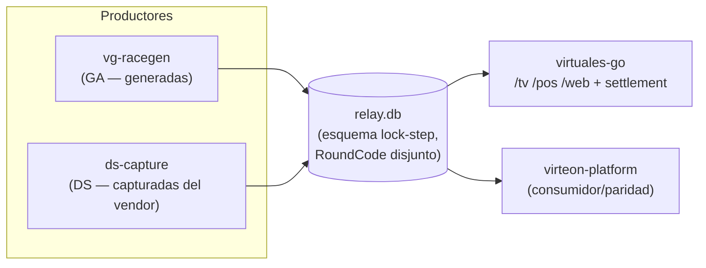

# Arquitectura — vg-racegen

> Productor **puro y determinista** de rondas de carreras virtuales "GA"
> (`dog6` / `dog8` / `horse_classic`). Genera competidores, condiciones,
> cuotas, orden de llegada y vídeo, y los escribe en una `relay.db` SQLite
> local más un audit log GLI encadenado. **No** maneja dinero, ni apuestas,
> ni settlement, ni broadcasting (eso es Paso 2 / vive en `virtuales-go`).

Module: `vg-racegen` · repo standalone `github.com/marcos-ugarte/race-generator`
· Go 1.25 · única dependencia directa `modernc.org/sqlite` (SQLite puro-Go).

---

## 1. Visión general

`vg-racegen` produce rondas de forma **determinista**: dado un seed fijo y el
mismo audit log, la salida se reproduce byte-a-byte. El binario
(`cmd/race-generator`) sostiene un scheduler que, por cada gameType, genera la
ronda y la persiste en una SQLite `relay.db`. Esa `relay.db` es la **junta**:
desacopla *producir* de *servir*. El feed/broadcaster (todavía NO en este repo)
es un **consumidor** que lee la `relay.db`.

Implementación: `main()` en `cmd/race-generator/main.go:178` arma los runners,
hace el boot síncrono (`bootBackfill`/`bootBulk`) y entra a `runScheduler`.

---

## 2. Los 4 componentes

| Componente | Repo / rutas | Rol | ¿Dinero? | ¿GLI? |
|---|---|---|---|---|
| **RNG** | `internal/racegen/rng/` (`mt19937.go`, `certified.go`, `state_modifier.go`) | Fuente determinista del sorteo (winner/pago) | No | **Sí — superficie certificable** |
| **Generador** | `internal/racegen/generators/`, `videoselector/`, `config/`, `data/` | Construye la ronda completa a partir del RNG | No | Sí (vía `videoselector.Select`) |
| **Relay** | `internal/sqlite/sqlite.go`, `internal/adapter/round.go` | Persiste la ronda en `relay.db` (la junta) | No | No (es transporte) |
| **Frontera Broadcaster/Feed** | *vive en `virtuales-go`* (NO aquí) | Sirve `/tv /pos /web`, apuestas, settlement, jackpot real | **Sí** | No |

El corte es deliberado: lo que toca un wallet (broadcaster + settlement +
`internal/pgpos`) queda fuera, aislando la superficie RNG certificable de todo
lo monetario (ver README "Scope boundary").

---

## 3. El núcleo RNG (certificable GLI)

El RNG es un **Mersenne Twister MT19937** (`internal/racegen/rng/mt19937.go`),
espejo funcional del `MersenneTwister.ts` de virteon-platform. Período
2^19937−1, tempering canónico Matsumoto-Nishimura.

Siembra (`makeMT` en `main.go:685`):
- **Determinista**: `RACEGEN_SEED_HEX` (64 hex) → `NewMT19937WithSeedHex`
  (`mt19937.go:51`) expande 32 bytes a 624 `uint32` vía **SHA-256 en cascada**.
- **Dev**: seed vacío → `NewMT19937FromOSEntropy` (`mt19937.go:78`) usa
  `crypto/rand` y emite un warning; el seed efectivo queda en el audit `init`.

Helpers certificados (`certified.go`): `CertifiedFloat`, `CertifiedInt`
(rejection sampling, sin sesgo de módulo), `CertifiedFloatRange`,
`CertifiedShuffle` (Fisher-Yates), `CertifiedNormal[Clamped]` (Box-Muller).

**Background cycling entre rondas** (GLI-19 §3.2.6) —
`ModifyStateBetweenGames` (`state_modifier.go:27`): tras cada ronda descarta
**1..100** `uint32` del MT, donde el conteo de descartes viene de **`crypto/rand`
independiente** (no del propio MT), con rejection sampling. Esto rompe la
predictibilidad ronda-a-ronda. La transición se registra en el audit como
`state_mod` (`reason="between_games"`, `discard=N`).

**La elección del vídeo = ganador/pago** — `videoselector.Select`
(`videoselector/selector.go:214`): cada gameType tiene un `Selector` con una
distribución acumulada **pre-ajustada por IPF** (Iterative Proportional
Fitting, 50 iteraciones por defecto, 3 pasos: 1º place / 2º place / corrección
exacta) sobre el pool de vídeos embebido. `Select` consume **un**
`CertifiedFloat` y hace búsqueda binaria sobre la acumulada → devuelve el
`VideoID` y su `Order` (orden de llegada). Ese vídeo **es** el resultado de la
carrera: define el ganador (`Order[0]`) y el segundo (`Order[1]`), y por tanto
el pago.

**Odds coupling** — `GenerateFinish` corre **antes** que `GenerateOdds`
(`generators/game.go:188-191`) para que la asignación de valores de cuota WIN
se acople al orden de llegada elegido (modelo Mallows-RIM o Plackett-Luce según
`OddsFinishCoupling` en config), de modo que los favoritos ganen al ritmo del
vendor DS. Solo cambia la *asignación*; el multiset de valores y por tanto el
overround/RTP se preservan.

**Certificable vs cosmético.** Lo que define el dinero —el sorteo del vídeo
(`Select`), el orden de llegada y las cuotas/pago— es la superficie
**certificable GLI**. Nombres de competidores, clima, temperatura, stats y la
historia del jackpot son **cosméticos**: salen del mismo MT pero no deciden
quién gana ni cuánto paga.

**Riesgo §3.3.2 (abierto).** MT19937 **no es un CSPRNG**: su estado interno es
recuperable observando 624 salidas. El `state_modifier` (descarte CSPRNG entre
rondas) mitiga la predictibilidad ronda-a-ronda, pero el plan B es encapsular
el RNG tras una interfaz y poder sustituir el motor por **ChaCha20** sin tocar
los generadores. Hoy `rng.MT19937` se
usa directo; la interfaz/encapsulación es Roadmap.

---

## 4. Flujo de datos

Por cada tick del scheduler (`runScheduler` → `tickHorizon`, `main.go:384-423`)
y por cada ronda de boot, el pipeline `generateAndPersist` (`main.go:610`)
ejecuta: `GenerateGame` → `ModifyStateBetweenGames` (audit `state_mod`) →
cooldown de nombres → `adapter.ToGameRound` → `sqlite.UpsertGameRound` +
`sqlite.SaveResult`.

**Horizonte (`RACEGEN_HORIZON`, default 25).** El scheduler mantiene N rondas
futuras pre-generadas por gameType. `tickHorizon` solo persiste **una** ronda
nueva por runner —el borde lejano del horizonte— y solo cuando un tick cruza un
límite de intervalo (`main.go:415`); el resto de ticks son no-ops (tick 1 s vs
intervalo 240 s). El horizonte es un buffer de resiliencia: si el generador se
reinicia, el pool `/tv` no se vacía.

**Boot (síncrono).** Antes del scheduler, dos fases idempotentes (`main.go:260`):
1. `bootBackfill` (`main.go:363`) — la ronda en curso + `bootBackfillPast`
   pasadas (cur−N..cur), para que existan rondas terminadas (no cold-start
   crash) y la línea temporal sea contigua hacia el pasado.
2. `bootBulk` (`main.go:330`) — el horizonte futuro (cur+1..cur+HORIZON).

Ambas son upsert-skip sobre slots ya presentes, así que un reinicio caliente o
una caída corta (< HORIZON intervalos) se auto-cubre con el buffer.

---

## 5. El `relay.db` (la junta)

Esquema **inline** en `internal/sqlite/sqlite.go` (`const createTableSQL`,
línea 125; columnas extra vía `alterMigrations`, línea 171). No hay archivos de
migración SQL.

Índice único `uniq_game_results_round_pos` sobre `GameResults(GameRoundId,
Position)` (`uniqueIndexDDL`, línea 184) evita filas duplicadas por posición.

- **`Status='F'` precomputado.** El adapter fija `Status:"F"` y
  `VideoStartDt/VideoEndDt` deterministas (`adapter/round.go:93,108`): como el
  generador produce todo de antemano, la ronda nace "finished". Los consumidores
  **no deben** filtrar por `Status` (todo es `F`, incluso futuras) sino por
  tiempo (`VideoStartDt` vs now).
- **Prefijo "GA".** `RoundCode = "GA" + CurrentRoundCode(...)`
  (`generators/game.go:177`). El resto del código (betoffer_schedule_fecha+nº)
  es **idéntico** al que emite el vendor DS para el mismo slot; solo cambia el
  prefijo `GA`. Eso garantiza PKs disjuntos (multi-writer safe bajo WAL) y que
  GA y DS para la misma carrera lleven el mismo número.
- **WAL mode.** `Init` (`sqlite.go:245`) aplica `journal_mode=WAL` (con retry,
  `applyWALWithRetry`) + `synchronous=NORMAL` + `busy_timeout(5000)`. WAL
  permite lectores concurrentes mientras el generador escribe.
- **Por qué desacopla.** La `relay.db` separa producir↔servir: permite copiar
  el archivo en paralelo, correr el generador y el consumidor por separado,
  comparar paridad GA↔DS, y hacer un cutover reversible sin tocar el productor.

---

## 6. Determinismo y reproducibilidad

- **Dentro de la ronda**: `GenerateGame` consume el MT en un **orden fijo**
  (competidores → condiciones → finish → odds → bonus → jackpot,
  `game.go:188-220`). Mismo estado de MT ⇒ misma ronda byte-a-byte. Esto lo
  pinan los golden tests (`generators/golden_test.go`, `rng/seed_golden_test.go`).
- **Entre rondas**: `ModifyStateBetweenGames` descarta `N` `uint32` con
  `crypto/rand` (`state_modifier.go:27`). `N` **no** es derivable del MT, así
  que para reproducir una corrida completa hace falta **seed + audit log**: el
  audit registra cada `state_mod` con su `discard`, lo que permite re-aplicar
  exactamente la misma secuencia de descartes.
- **Validación de paridad**: golden vectors en CI (garantía de no-drift del
  RNG) + harness de paridad contra DS/virteon (Roadmap). El audit
  `init` fija el `seedHex` efectivo; `audit.Verify` (`audit/log.go:171`)
  comprueba que la cadena SHA-256 no fue alterada.

---

## 7. Fronteras (productor vs consumidor)

El **broadcaster** (`/tv /pos /web` WS/HTTP) y el **settlement** (apuestas,
tickets, jackpot real, `internal/pgpos`) NO viven aquí: acoplan dinero y
PostgreSQL, y deben quedar fuera de la superficie RNG certificable. Este repo es
simétrico a **`ds-capture`** (el productor del feed DS real): ambos escriben la
**misma** `relay.db` con esquema lock-step (`sqlite.Fingerprint`, `sqlite.go:56`),
con prefijos de `RoundCode` disjuntos (`GA*` vs `141_/241_/541_/...`).

---

## 8. GLI

- **Superficie certificable** (archivos): `internal/racegen/rng/mt19937.go`,
  `certified.go`, `state_modifier.go` y `internal/racegen/videoselector/selector.go`
  (`Select` = el sorteo que decide ganador/pago). El acoplamiento odds↔finish
  (`generators/odds.go`, config `OddsFinishCoupling`) entra en cuanto afecta el
  pago.
- **El audit como evidencia de replay.** `internal/racegen/audit/log.go`:
  JSONL append-only, cada entrada con SHA-256 de la anterior (`computeHash`,
  línea 146; `Verify`, línea 171). Genesis con `prevHash==""`, `seq` monótono.
  Imposible reescribir el pasado sin invalidar la cadena → evidencia de que la
  corrida certificada es la que ocurrió.
- **Seed fail-closed.** `loadEnv` (`main.go:778-795`): con `APP_ENV` ∈
  {`prod`,`production`,`staging`,`stg`} un `RACEGEN_SEED_HEX` ausente **aborta**
  el binario (GLI-19 §3.3 — el replay debe ser determinista). En dev se tolera
  `crypto/rand`.
- **Disciplinas.** `dog8` (541) y `dog6` (141) están calibradas contra DS y son
  las **abiertas**. `horse_classic` (241) tiene pool de finish **real** (el
  ganador sí tracks al vendor) pero **odds placeholder** (calibración
  smoke-level, `RankGap`/`ForecastRank` deshabilitados): el **GLI gate sigue
  cerrado** para 241 hasta tener marginales por-rank reales (ver doc de
  `horseClassicConfig`, `config/extended.go:735`). `horse` (251) y `dog63`
  (741) **no se generan** (no están en el registro de `racegen/config`).

---

## 9. Roadmap

- **Paso 2 — Feed.** Servidor `/v1/races` + WebSocket + auth sobre la
  `relay.db`, siguiendo el contrato de `ds-capture`. Este repo hoy NO publica
  puertos (ver Dockerfile / compose).
- **Encapsular el RNG** tras una interfaz (`Source`/`RNG`) para poder cambiar
  MT19937 → ChaCha20 sin tocar generadores (plan B §3.3.2).
- **Harness de paridad** automatizado GA↔DS (Elastic / virteon) como gate de CI
  además de los golden vectors.
