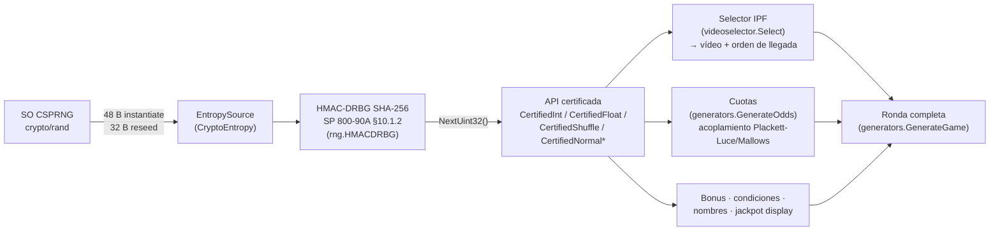

# Descripción técnica del RNG — vg-racegen

**Documento de sumisión** (GLI Composite Submission Requirements v2.0 §2.2, "RNG Description and Documentation" + "Technical Source Code Description").
**Versión del software:** rama `rng/gli19-drbg` — la versión final se identifica por los SHA-256 de `evidencia/hashes.txt` en el momento del code freeze.
**Estándar:** GLI-19 v3.0 cap. 3 · NIST SP 800-90A Rev. 1 · NIST SP 800-22 Rev. 1a.

---

## 1. Arquitectura general

Toda la aleatoriedad que determina resultados de juego fluye por un único camino:

- **Fuente** (`internal/racegen/rng/hmac_drbg.go`): HMAC-DRBG con SHA-256 conforme a
  NIST SP 800-90A Rev. 1 §10.1.2, validado contra los known-answer tests oficiales
  NIST CAVS 14.3 (6 vectores: `no_reseed` y `pr_false`; ver
  `hmac_drbg_test.go`). Seguridad 256 bits.
- **Entropía** (`entropy.go`): `crypto/rand` del sistema operativo (Linux:
  `getrandom(2)`). Desde Go 1.24 la lectura no falla en SO soportados; el contrato
  `EntropySource` propaga error igualmente y la generación se DETIENE ante fallo
  (nunca degrada — §6).
- **Consumo**: una única instancia de DRBG por proceso, consumida en serie desde la
  goroutine del scheduler (sin concurrencia sobre el stream; invariante documentado
  en `rng.Source`).

## 2. El DRBG en detalle

| Parámetro | Valor | Referencia |
|---|---|---|
| Mecanismo | HMAC_DRBG, SHA-256 | SP 800-90A §10.1.2 |
| entropy_input (instantiate) | 32 bytes del CSPRNG del SO | §8.6.7 (≥ security strength) |
| nonce | 16 bytes del CSPRNG del SO | §8.6.7 (≥ strength/2) |
| personalization_string | `"vg-racegen/race-generator/v1"` | §8.7.1 (no secreta) |
| Reseed automático | cada 10 000 peticiones de generación | ≪ límite 2^48 del estándar |
| Reseed explícito | en cada frontera de ronda, sin `additional_input` (la frescura la aporta la EntropySource; un identificador de ronda contendría datos de reloj y haría el stream de laboratorio función del instante de arranque en vez de la semilla) | §10.1.2.4 |
| Bytes por petición interna | 1 024 (`drbgChunk`) | ≪ límite 2^19 bits/petición |
| additional_input en Generate | no se usa (la actualización post-generación §10.1.2.5 paso 6 se ejecuta igualmente) | |

Los disparadores de reseed son **deterministas a propósito** (conteo de peticiones y
fronteras de ronda; nunca reloj de pared): el modo laboratorio (§5) debe reproducir
la secuencia completa como función exclusiva de la semilla.

`NextUint32` consume el key-stream del DRBG en palabras big-endian de 4 bytes. La
herramienta de extracción (`cmd/rngextract -mode bits`) escribe esas mismas palabras
big-endian, de modo que el archivo binario entregado al laboratorio ES el stream
crudo del DRBG sin transformación.

## 3. Escalado y primitivas certificadas (`certified.go`)

- **`CertifiedInt(src, min, max)`** — entero uniforme en `[min, max]` por **rejection
  sampling**: se calcula el mayor múltiplo `M` del rango `r = max-min+1` que cabe en
  `2^32`; los draws `v ≥ M` se descartan y se re-extrae. El conjunto de aceptación
  tiene tamaño exactamente divisible por `r` ⇒ distribución exactamente uniforme,
  **sin sesgo de módulo**. Probabilidad de descarte < r/2^32 (para r=8: < 2·10⁻⁹).
- **`CertifiedFloat(src)`** — float64 uniforme en `[0,1)` con **53 bits de
  resolución**: dos draws de 32 bits (alto primero), los 53 bits superiores del par
  dividen `2^53`. Resolución completa de la mantisa IEEE-754.
- **`CertifiedShuffle`** — Fisher-Yates con índices de `CertifiedInt` (sin sesgo).
- **`CertifiedNormal`** — Box-Muller (se usa z₀; consume dos floats). `u1=0` se
  sustituye por `1e-12` para evitar `log(0)` (probabilidad 2⁻¹⁰⁶ por draw).
- **`CertifiedNormalClamped`** — normal truncada por re-muestreo (≤ 50 intentos);
  si los 50 fallan, satura al borde más cercano. Con los parámetros de producción
  la probabilidad de saturación es < 10⁻²⁰ por llamada (rangos a ≥ 3σ de la media);
  el caso existe solo como salvaguarda anti-NaN y se declara aquí explícitamente.

## 4. Mapeo número → símbolo (resultado de juego)

El resultado de una carrera es la selección de un **vídeo pregrabado** cuyo orden de
llegada está fijado por el catálogo embebido (`internal/racegen/data`, JSON
verificados por SHA-256 en el código fuente).

1. **Pesos IPF** (`videoselector.New`, en arranque): los pesos del pool se ajustan
   por Iterative Proportional Fitting (50 iteraciones: marginal de 1.º puesto,
   marginal de 2.º, corrección suave de exactas factor 0.2) hacia las
   probabilidades objetivo declaradas en la configuración del juego
   (`TargetFirstPlace` / `TargetSecondPlace`). El resultado es una distribución
   acumulada inmutable.
2. **Selección** (`videoselector.Select`): un `CertifiedFloat` × peso total +
   búsqueda binaria sobre la acumulada ⇒ una entrada del pool (vídeo + orden
   completo). **Un draw por ronda decide el resultado**; ninguna otra llamada
   posterior puede alterarlo.
3. **Cuotas** (`generators.GenerateOdds`): se generan DESPUÉS del resultado y solo
   re-etiquetan presentación: el multiset de valores de cuota de la ronda se asigna
   a los corredores mediante una permutación Plackett-Luce (o Mallows-RIM)
   acoplada al orden ya decidido, de modo que los favoritos tienden a ganar con las
   probabilidades declaradas. La permutación **preserva exactamente el multiset**
   ⇒ overround y RTP de la ronda no dependen del acoplamiento. La causalidad es
   estrictamente resultado → presentación; jamás apuesta → resultado.
4. El resto de draws de la ronda (condiciones, nombres, bonus, jackpot de display,
   checkpoints intermedios) son cosméticos: no alteran resultado ni pagos.

El consumo del stream por ronda queda huellado en el audit log (`mtSeqAfter` =
contador de generación tras la ronda; hash de cuotas y de competidores), lo que
permite al laboratorio verificar que cada petición consume salida nueva sin
reordenación ni descarte selectivo (GLI-19: no cherry-picking).

### Ciclo entre rondas

Tras cada ronda, la transición certificada `rng.BetweenRounds` — **el mismo
helper compartido** por el binario de producción y la herramienta de extracción,
de modo que "same RNG and methods" es estructural: (a) descarte de 1–100 valores
(conteo extraído del propio stream con `CertifiedInt`); (b) **reseed explícito
del DRBG** con entropía fresca de la EntropySource, sin `additional_input`. El
reseed aporta prediction resistance real entre rondas; el descarte se mantiene
como defensa en profundidad. La entrada de auditoría `state_mod` registra
`discard`, `genBefore` y `genAfter`, de modo que el consumo del stream entre dos
rondas consecutivas es **íntegramente reconciliable** desde el audit log
(`game_generated.mtSeqAfter → genBefore` cubre la extracción del conteo;
`genBefore → genAfter` es el descarte): no existen draws sin explicar.

## 5. Política de seeding y modo laboratorio

| | Build de producción (por defecto) | Build de laboratorio (`-tags gli_lab`) |
|---|---|---|
| EntropySource | `crypto/rand` (SO) | expansor determinista HKDF-SHA256 de una semilla de 32 bytes |
| `RACEGEN_SEED_HEX` / `-seed` | **rechazado — el binario aborta** | **obligatorio** |
| Reproducibilidad | ninguna (por diseño) | secuencia de draws bit a bit, función exclusiva de la semilla¹ |
| DRBG y disparadores de reseed | idénticos | idénticos |
| Símbolos MT19937 / LabEntropy en el binario | **ninguno** (gate de CI con `go tool nm`) | LabEntropy presente |

¹ Alcance del replay en el binario scheduler: la **secuencia de draws** es
función exclusiva de la semilla (ningún disparador de reseed ni input del DRBG
depende del reloj). La **identidad de las rondas** (roundCode, slots) sigue
anclada al instante de arranque del scheduler; para evidencia con identidad
también reproducible se usa `cmd/rngextract -mode game`, que fija el slot
inicial — es la herramienta de recolección oficial de la sumisión.

La única diferencia entre builds es la implementación de `EntropySource`; el DRBG,
el escalado y todo el pipeline de juego son el mismo código ("same RNG and
methods"). La semilla de laboratorio jamás aparece en logs: el audit log registra
únicamente un descriptor de fuente y, en lab, el fingerprint SHA-256 de la semilla.

El MT19937 que existió como fuente histórica permanece en el repositorio
exclusivamente como generador determinista de tests (vectores golden de paridad con
el motor legado); no se compila en ningún binario distribuible.

## 6. Fallo seguro (GLI-19 R11)

- Fallo de entropía en instanciación o reseed explícito ⇒ error fatal del proceso
  (el generador no arranca / la ronda no se emite).
- Fallo de entropía en reseed automático dentro de `NextUint32` ⇒ `panic`
  inmediato. No existe ningún camino de degradación a un PRNG no criptográfico ni
  a una semilla fija. (`math/rand` no aparece en el módulo: verificable con
  `grep -r "math/rand" --include="*.go"` ⇒ 0 usos.)

## 7. Identificación de versión y herramientas de recolección

- Binarios compilados con `-trimpath`; versión/commit inyectados por `-ldflags`.
- `make evidence-tools` construye las herramientas y registra sus SHA-256 en
  `evidencia/hashes.txt`. Los datos de evidencia se regeneran con comandos
  documentados (`make evidence-bits`, `evidence-games`, `evidence-int`) y la
  semilla de la corrida queda registrada.
- `cmd/rngextract` es la **Raw Output Collection Tool** (`-mode bits`, binario,
  ≥ 96 Mbit hasta GB) y la **Final Outcome Collection Tool** (`-mode game`, CSV de
  resultados finales con el pipeline completo de producción), según §2.2 del
  Composite Submission Requirements. `-mode int` produce además la evidencia
  específica del rejection sampling sobre los rangos reales del juego (6 y 8).

## 8. Trazabilidad código → requisito

| Requisito GLI-19 v3.0 | Implementación | Evidencia |
|---|---|---|
| Imprevisibilidad (R3) / estado no deducible (R4) | HMAC-DRBG SHA-256 | KATs CAVS 14.3; SP 800-90A |
| Seeding impredecible (R5) | crypto/rand 48 B; seed prohibida en prod | `source_prod.go`; test `TestMakeSource_ProductionBuild` |
| Re-seeding (R6) | auto 10k + frontera de ronda | `hmac_drbg.go`; `TestHMACDRBG_AutoReseed` |
| Ciclado entre juegos (R7) | reseed + descarte 1–100 | `state_modifier.go`; audit `state_mod` |
| Escalado sin sesgo (R8) | rejection sampling | §3; `rngextract -mode int` |
| No cherry-picking (R9) | un draw decide el resultado; huella `mtSeqAfter` | §4; audit log |
| Fallo seguro (R11) | error/panic, sin fallback | §6; `TestHMACDRBG_AutoReseed` |
| Versión certificada (R13) | -trimpath, hashes, gate nm en CI | §7; `.github/workflows/ci.yml` |
